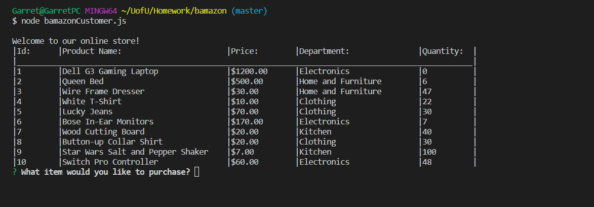
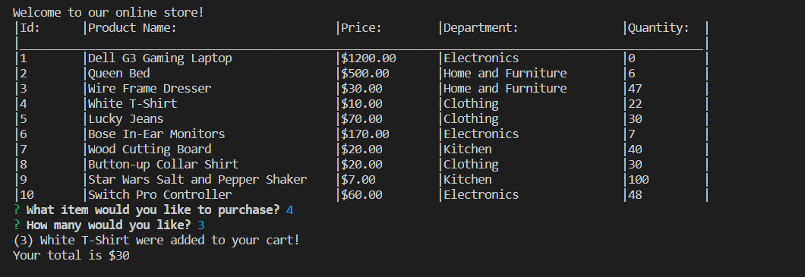
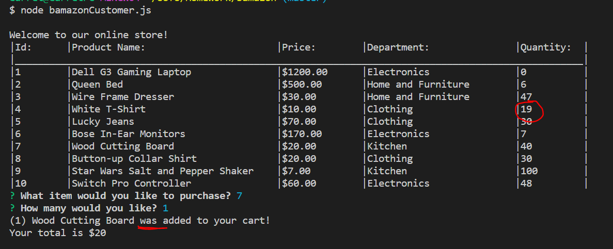

# bamazon
## "bamazon" node console-based storefront
##### Author: Garret Rueckert
***

## About
bamazon is a command-line Node application that uses a MySQL database to simulate a storefront and customer shopping cart

  - ***Spotify*** - track-search, Node specific version of API
  - ***BandsInTown*** - concert search by artist
  - ***OMBD*** - movie database search by title

## How to use
Currently only the customer configuration is set up, so type the following into the console:
```
$ node bamazonCustomer.js
```
Users will be prompted to select an item (by item id) from the table of products. The list of products is populated from the database.

## Tech Used

Bamazon uses a variety of node packages to work:

* [mysql](https://www.npmjs.com/package/mysql) - mysql implementation into node
* node.js - Runtime environment for the JavaScript
* [inquirer](https://www.npmjs.com/package/inquirer) - a command line user interface for node, stores user answers on an object
* [sprintf-js](https://www.npmjs.com/package/sprintf-js) - printf emulater for node


## Examples

Prompts the user on startup

Buying an item

As highlighted here, the quantity in the database for white shirt was changed. Also a single item changes the word "were" to "was" in the console.


## Todos
- Add a "manager" view to add items to database or make edits
- A proper cart with user log in and saving of the items until checkout
- Allow users to refine a search by price or department
- More testing for break-case scenarios
- Better error handling
